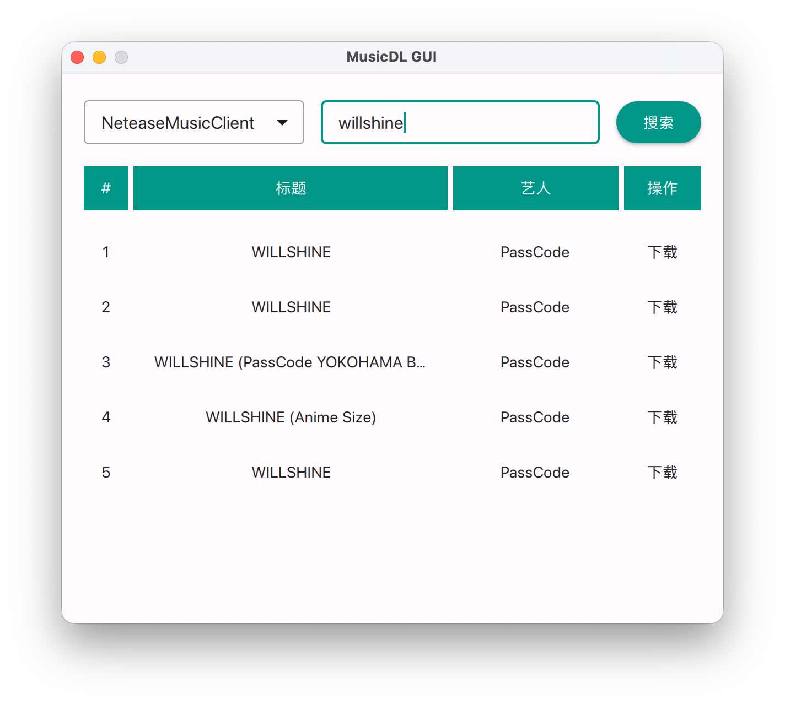

# MusicDL GUI

## 简介


这是一个基于[musicdl](https://github.com/CharlesPikachu/musicdl)的GUI程序，使用PyQt6开发

## 功能

✅ 自定义下载位置  
✅ 自动编码下载的歌曲 (包括封面图片和meta信息)*  
✅ 多个平台搜索

\* 自动编码时以`{艺人名}-{歌曲名}.mp3`命名，如果源文件是flac你可以选择保留源文件或只保留mp3，否则转码后则会替换原始文件

## 截图



## 打包

### Windows

```bash
pyinstaller --noconfirm --clean win.spec
```

### macOS

```bash
pyinstaller --noconfirm --clean mac.spec
```